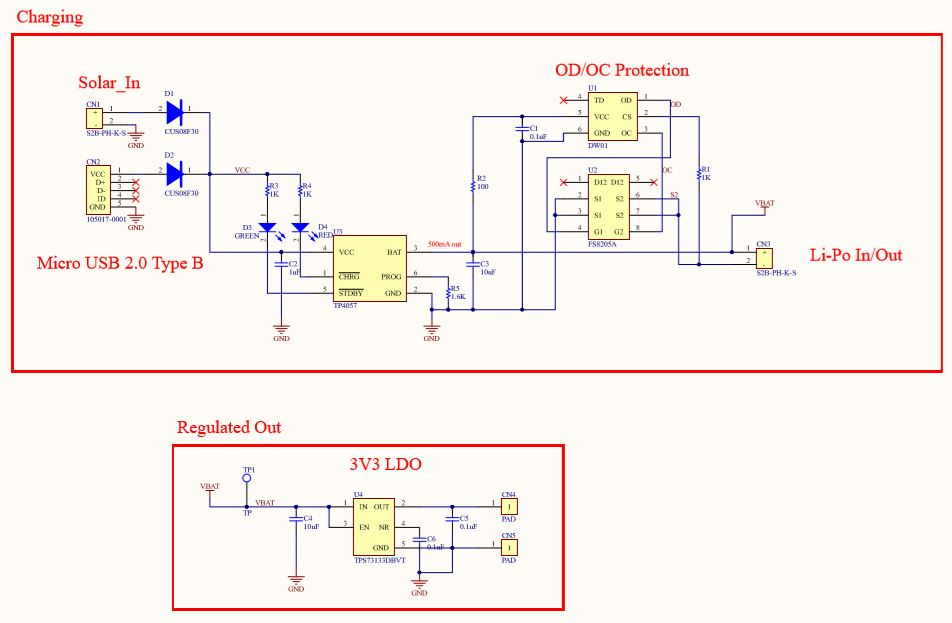
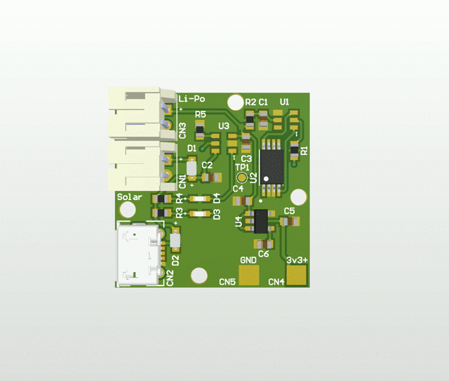
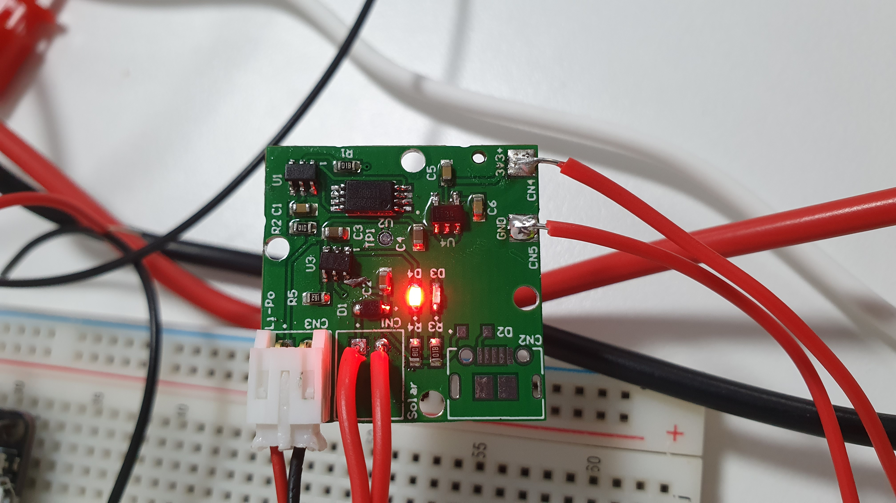
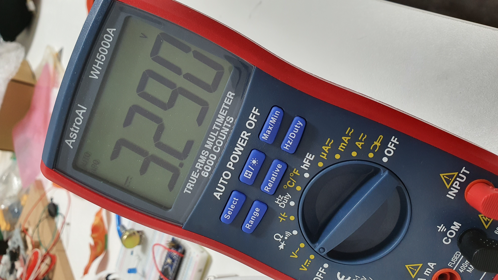
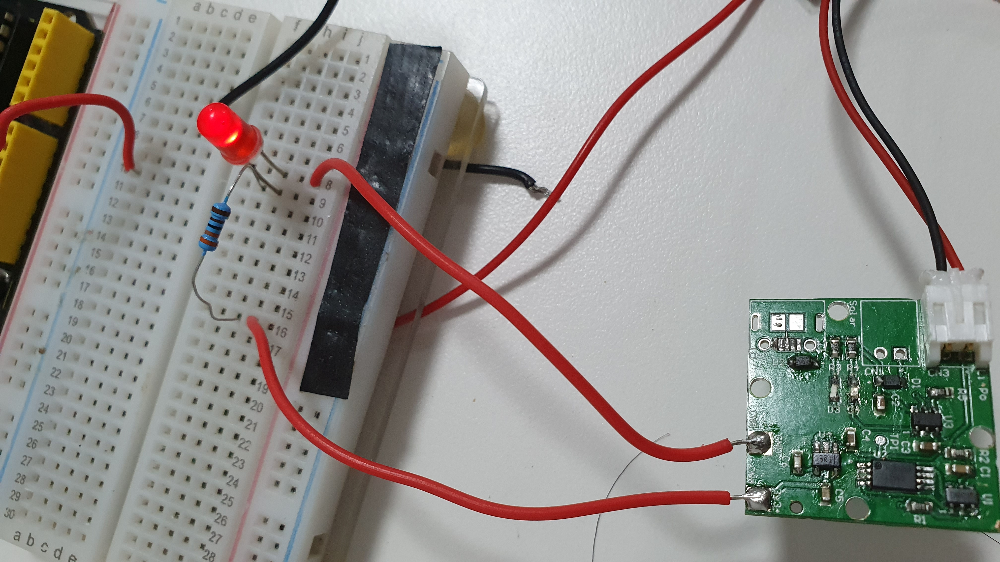

# Solar LiPo Manager
## Goal
Develop a PCB that supports LiPo charging by either Solar/USB input with battery protection features integrated. Then output a regulated 3.3V output to power other electronics, mainly low power microcontroller.

## Requirments:
1. 2 Methos of charging : Solar and USB
2. Output must be stable at 3.3V
3. Add in battery protection IC's

## Implementation:

### Schematic:
 

### PCB:
  
Actual Product: 
 
RED led --> Charging 
Green led --> Done 
### Testing/Verification:
3.3 Regulated output:
 
Powered  circuit:
 

### Conclusion/Problems
